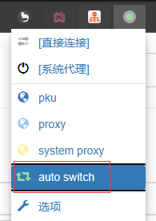

# 把VPN转换为代理

通过docker，这个项目把VPN连接为代理，可用于HTTP/HTTPS, SSH或者任何连接，可运行于Windows, Linux和macOS上！


- [把VPN转换为代理](#把vpn转换为代理)
- [如何使用？](#如何使用)
	- [1. 配置](#1-配置)
	- [2. 运行代理](#2-运行代理)
- [设置代理服务器](#设置代理服务器)
	- [git](#git)
	- [大多数命令行程序](#大多数命令行程序)
	- [浏览器](#浏览器)
- [SSH](#ssh)
	- [1. 配置SSH客户端使其使用本代理](#1-配置ssh客户端使其使用本代理)
	- [2. 使用镜像中的SSH客户端](#2-使用镜像中的ssh客户端)
- [端口转发](#端口转发)
- [原理](#原理)
- [实现](#实现)

# 如何使用？

## 1. 配置

1. Clone这个repo
2. 在repo的目录下，创建一个`.env.example`文件的副本，并将副本命名为`.env`
3. 按以下格式修改`.env`文件

```env
# 在容器内连接VPN的命令
CMD=

# HTTP代理监听的端口
PORT=8888

# 端口转发配置
# 本地监听端口。即使你不用端口转发，也不要注释掉这一行
PF_PORT=18889
```

`configs`文件夹下放了一些大学的`CMD`值的示例。

如果`configs`目录下有您的大学/组织，按照以下步骤操作：

1. 阅读对应文件的开头的注释部分，并按您的情况修改文件最后一行的命令
2. 复制文件最后一行，粘贴到`.env`文件的`CMD=`之后

如果`configs`目录下没有您的组织，您可以按照以下步骤尝试找到连接您的VPN的命令：

1. 运行`docker compose build`构建镜像
2. 运行`docker run -it --cap-add=NET_ADMIN ghcr.io/ddadaal/vpn-as-http-proxy:master`启动一个容器
3. 在容器中，借助`openconnect`程序，尝试使用**一行**命令连接到您的VPN
4. 把这个命令添加到`.env`文件的`CMD=`之后
5. （可选）提交一个PR，把您的组织的配置文件提交到`configs`目录下！

注意：

- 只使用这一条命令就能连接到VPN，运行命令后不能再有任何输入（比如输入用户名密码）。所以，您的所有配置（包括用户名密码）都需要被包含在这个命令中
- 命令中请尽量使用双引号包裹命令中的字符串。命令执行的时候会被包括在**一对单引号**中，所以如果您发现您的命令不能正常使用，尝试加点转义符。
- 如果`openconnect`运行起来之后没有自己退出，VPN连接应该就成功了，可以无视之后的报错

## 2. 运行代理

在`.env`文件配置好之后，按以下方式运行代理：

1. 运行`docker compose up` 
    - 加`-d`后台运行
    - `docker compose`将会自动从`GitHub Packages`上拉取已经构建好的镜像，如果太慢了，可以选择增加`--build`选项在本地构建镜像
2. 把需要走VPN的程序的代理设置为`http://localhost:{PORT}`（{PORT}和`.env`文件里设置的PORT值一致）
3. 容器需要保持运行
4. 使用`Ctrl-C`或者使用`docker kill vpnproxy`来关闭代理
q
经测试，在一个容器里连接的VPN不会影响其他容器和主机的网络连接。

# 设置代理服务器

代理服务器跑起来之后，给需要走内网的应用设置HTTP和HTTPS代理到`http://localhost:{PORT}`（`{PORT}`为`.env`中设置的值，默认为8888）。

一些常见设置（下面均使用8888为端口，如果为其他端口请自行更改）.

## git

```bash
# 只修改当前repo
git config http.proxy http://localhost:8888
git config https.proxy http://localhost:8888
```

## 大多数命令行程序

```powershell
# Windows PowerShell
$env:HTTP_PROXY="http://localhost:8888"
$env:HTTPS_PROXY=$env:HTTP_PROXY
```

```bash
# Linux/macOS
export HTTP_PROXY=http://localhost:8888
export HTTPS_PROXY=$HTTP_PROXY
```

## 浏览器

使用**Proxy SwitchyOmega**（[Chrome Web Store](https://chrome.google.com/webstore/detail/proxy-switchyomega/padekgcemlokbadohgkifijomclgjgif)）扩展，然后按照以下操作：

1. 设定页中，选择**新建情景模式**，名字任意，类型为代理服务器


2. 左边选择新建的情景模式，右侧**代理协议**为HTTP，**代理服务器**填写为`localhost`，**代理端口**填写为**8888**，然后点击左侧**应用选项**


3. 左边选择auto switch，在右边给需要代理的URL设置情景模式为之前自己创建的情景模式，默认情景模式设置为`system proxy`（系统代理），然后点击左侧应用选项


4. 在浏览器菜单栏中找到这个扩展的菜单，选择`auto switch`



完成。之后访问第三步中设置的URL时将会自动走HTTP代理，其他的将会走系统代理。

# SSH

主要有两种方式可以使用SSH。

## 1. 配置SSH客户端使其使用本代理

这是推荐的方法。

我们可以使用SSH客户端的`ProxyCommand`配置。这个配置好了之后，所有使用本地OpenSSH客户端的应用都可以使用代理访问服务器，其中还包括VSCode的Remote SSH功能！

1. 在机器上安装需要的程序
   - 在Arch Linux上为`openbsd-netcat`和`connect`。在不同的发行版上程序包名可能不同，这是Arch Linux下的包名。如果是其他操作系统，请参考下面的StackOverflow的问题
   - 在Windows上我们需要`connect.exe`。这个应用程序包含在`MinGW64`上，`Git for Windows`将会自动安装`MinGW`。所以你应该可以在Git安装目录的`mingw64/bin`目录下找到这个应用程序
2. 在`~/.ssh/config`中填写如下内容，并按您的需要和真实配置替换<>中的内容

```
Host <需要使用代理进行连接的地址>
    ProxyCommand          nc -X connect -x localhost:{.env中配置的代理服务器端口} %h %p
	# Windows用户请参考下列地址
	# ProxyCommand {connect.exe的路径，如果需要的话加上引号} -H localhost:{.env中配置的代理服务器端口} %h %p
```

如果SSH连接时遇到了问题，请参考这个StackOverflow的问题(https://stackoverflow.com/questions/19161960/connect-with-ssh-through-a-proxy)。


## 2. 使用镜像中的SSH客户端

镜像中默认安装了SSH，接下来只需要进入容器的`bash`中，即可通过SSH链接到内网机器了。在容器启动时将主机的`~/.ssh`目录映射到了容器的`/root/.ssh`目录，主机和容器共享SSH密钥对。所以主机能免密登录的机器，容器也可以。

另外，容器的所有流量将会走VPN，所以也可以在容器中使用必须走VPN的程序。

```bash
# 1. 进入容器
# Windows PowerShell
pwsh bash.sh

# Linux/macOS
./bash.sh

# 2. 连接ssh
ssh username@ip
```

# 端口转发

你还可以使用此代理来进行本地端口到远程地址的某个端口的转发，可用于Windows远程桌面等非HTTP场景。

通过如下`.env`配置来配置此功能：

```env
# 在本机监听的端口
PF_PORT=18889

# 转发目标
PF_DEST=10.2.3.4:10203
```

程序启动后，您对所有`localhost:18889`端口的流量将会被转发到`10.2.3.4:10203`中。

# 原理


VPN可以被用来在外网访问内网资源。但是，一旦连接VPN，系统里的所有流量都会被转发到VPN，对于不需要走VPN的流量，这会带来一些不必要的网络延迟，影响网络速度。

现在的大多数应用程序都支持**代理**(proxy)功能。如果一个应用程序被设置了代理，程序的流量将会被发到代理服务器上，由代理服务器发送到真正的目的地。

所以，如果我们有一个连接到VPN的代理服务器，那么，设置了代理的应用程序的流量就会走VPN，而没有设置这个代理的程序发出的流量就不会经过VPN。

这个项目就是创建docker镜像，它的功能就是上文提到的这个**连接到VPN的代理服务器**。这个容器有两个功能：

1. 连接到VPN
2. 启动一个代理服务器进程，它监听一个端口，并直接转发这些流量

由于这个容器整体连接到了VPN，所以由这个容器发出的流量都会走VPN。所以，我们只需要设置我们需要走VPN的程序的代理程序为`http://localhost:{PORT}`，这样这些程序的流量就会走这个代理，然后走VPN，这样就可以访问内部资源了。

请查看[我博客上的相关文章](https://ddadaal.me/articles/vpn-as-http-proxy)，对VPN、代理以及本方案进行了更详细的介绍。

# 实现

- Docker base image: `debian:buster-slim`
- VPN client: `openconnect`
- Proxy: `tinyproxy`

