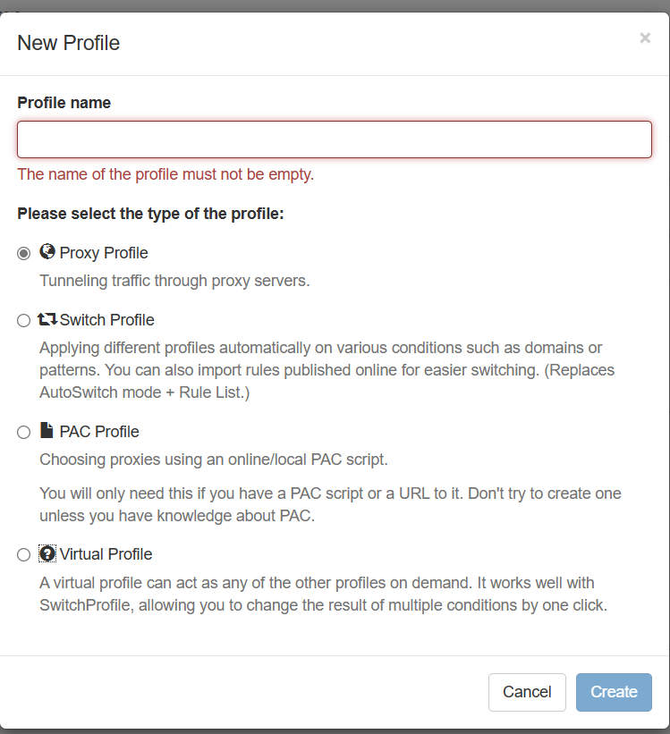
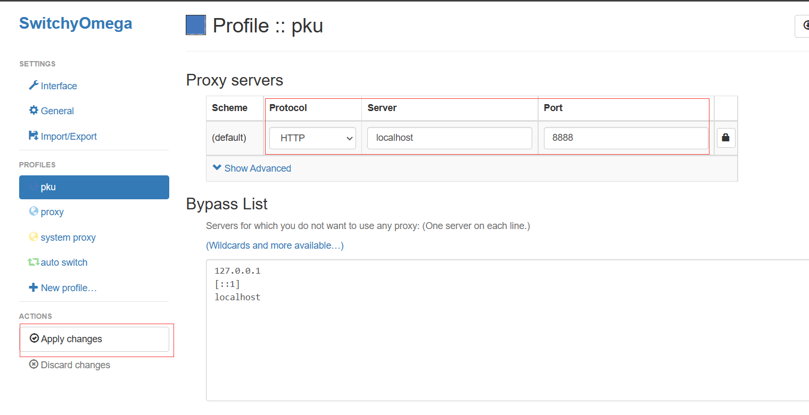
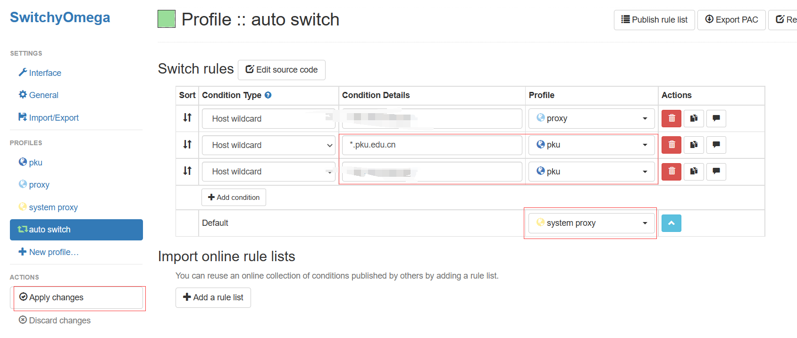
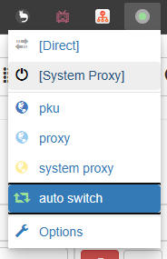
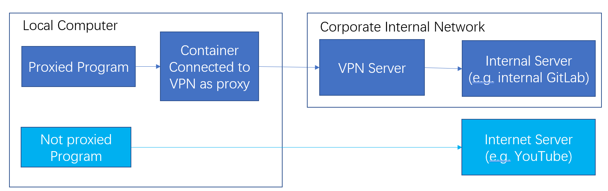

# Use VPN as a HTTP proxy server

[中文](README.cn.md)

Also support SSH!

- [Use VPN as a HTTP proxy server](#use-vpn-as-a-http-proxy-server)
- [How to use?](#how-to-use)
	- [1. Configuration](#1-configuration)
	- [2. Run Proxy Server](#2-run-proxy-server)
- [Set proxy server for apps](#set-proxy-server-for-apps)
	- [git](#git)
	- [Most CLI programs](#most-cli-programs)
	- [Browsers](#browsers)
- [SSH](#ssh)
	- [1. Make SSH client use this proxy](#1-make-ssh-client-use-this-proxy)
	- [2. Using SSH client in this image](#2-using-ssh-client-in-this-image)
- [Motivation](#motivation)
- [Implementation](#implementation)


# How to use?

## 1. Configuration

1. Clone the repo
2. Create a copy of `.env.example` file and name the new file to exactly **`.env`** under the cloned folder 
3. Modify the `.env` file as follows:

```env
PORT=the listening port in your host, for example 8888
CMD=the command to connect to your VPN using openconnect
```

Example CMD values of several universities are under the `configs` file. 

If your organization is included:

1. Read the comments of the config file and modify the command accordingly
2. Append the last uncommented line after `CMD=` in your `.env` file

If not, you can do the followings to experiment and find the command to connect to VPN:

1. Run `docker compose build` to build the image
2. Run `docker run -it --cap-add=NET_ADMIN ghcr.io/ddadaal/vpn-as-http-proxy:master` to start a container
3. Try connecting to your VPN with `openconnect` **in one line**
4. Append the command after `CMD=` in your `.env` file
5. (Optional) Submit a pull request to add your organization's config in the repo!

Note: 

- The command itself should be able to your VPN without any intervention (like inputting credentials), so all your configs, including credentials, should be included in the command
- The CMD will be wrapped inside a pair of single quotes to run, so use double quotes to wrap your strings in your command, and escape your command if necessary
- If `openconnect` does not exit, the connection is already successful. Some errors can be ignored in this case.

## 2. Run Proxy Server

After the `.env` file is configured, you can run the proxy:

1. Run `docker compose up` to start the container
	- add `-d` option to run in the background
	- `docker compose` will pull the prebuilt image from `GitHub Package`. If it is too slow for you, you can build the images by adding `--build` option
2. Set the proxy server of your apps to `http://localhost:{PORT}` (the PORT you set in the `.env` file)
3. The container should keep running for the proxy to work.
4. Press `Ctrl-C` or use `docker compose down` to stop the container.

It is tested that the VPN connected in one container are isolated with other containers, i.e. the other containers are not connected to the VPN connected by one container.

# Set proxy server for apps

Set the HTTP/HTTPS proxy server of apps to `http://localhost:{PORT}` (the PORT you set in the `.env` file)

The followings are some examples. All examples use 8888 as the port number. Change it if needed.

## git

```bash
# Only for the current repo
git config http.proxy http://localhost:8888
git config https.proxy http://localhost:8888
```

## Most CLI programs

```powershell
# Windows PowerShell
$env:HTTP_PROXY="http://localhost:8888"
$env:HTTPS_PROXY=$env:HTTP_PROXY
```

```bash
# Linux/macOS
export HTTP_PROXY=http://localhost:8888
export HTTPS_PROXY=$HTTP_PROXY
```

## Browsers

Install **Proxy SwitchyOmega**（[Chrome Web Store](https://chrome.google.com/webstore/detail/proxy-switchyomega/padekgcemlokbadohgkifijomclgjgif)）Extension, and configure it as follows:

1. Create a new profile with any name. Set the type to **Proxy Profile**.



2. Select the new profile, and set the **protocol** to **HTTP**, the **Server** to **localhost**, and the **Port** to **8888**. Click the **Apply changes** button on the left.



3. Select **auto switch** on the left, and set the domains you wish to use VPN to use the new profile. Set the default profile to **system proxy**. Click the **Apply Changes** button on the left.



4. Click the menu button of the extension (usually besides the URL bar), and select **auto switch**.



Completed. When accessing the URLs set in the step 3, the browser proxies the traffic to the proxy. 

# SSH

There are mainly 2 ways to use SSH with proxy.

## 1. Make SSH client use this proxy

We can utilize SSH client's `ProxyCommand` config to use HTTP proxy.

Please checkout this stackoverflow question (https://stackoverflow.com/questions/19161960/connect-with-ssh-through-a-proxy). Replace `PROXYHOST:PROXYPORT` with the address and port of this proxy server. The configurations mainly include the following steps:

1. Install needed programs
   - In Arch Linux the programs are `openbsd-netcat` and `connect`. It differs in different distributions and OSs, so please check out the stackoverflow question above.
2. Add the following content into `~/.ssh/config`, replacing the content in <> accordingly

```
Host <The address to be connected with proxy>
    ProxyCommand          nc -X connect -x localhost:<proxy server port in .env> %h %p
```

If you encounter any error, check out other answers and comments in that stackoverflow question.

This is the recommended approach.

## 2. Using SSH client in this image

SSH is installed in the image. When the container is running, you can access the container by starting a `/bin/bash` process. The `~/.ssh` directory is mapped to `/root/.ssh` of the container, so the container shares SSH key pairs with the host.

Also, since the container is connected to the VPN, all apps running in the container will use VPN.

```bash
# 1. Access the container's bash
# Windows PowerShell
pwsh bash.sh

# Linux/macOS
./bash.sh

# 2. Connect by SSH
ssh username@ip
```

# Motivation



VPN is used to access internal resources that can only be obtained in the internal network of your corporation. However, connecting to VPN in your device makes all network traffic forwarded to the VPN, which adds network latency and affects speed for requests that can be accessed without VPN. 

Most applications now support proxy. If a proxy is set for an app, all traffic from the app will go to the proxy instead of go directly to the Internet. The proxy will then sends the traffic to its real destinations.

Therefore, if we have a proxy that is connected to VPN, we can only set the proxy of the apps that needs internal resources. Only the traffic of these apps will go to the VPN. The apps whose proxy is not set will NOT go to the VPN, which addresses our original issue.

This project creates a docker container that does exactly what is mentioned above. This container does 2 things:

- connects to your VPN
- listens to a port, from which the container receives incoming HTTP requests and "re-sends" them

Set the proxy of your application to `http://localhost:{port}`, and all the HTTP requests from the app will go to the container. The container just simply resends the requests without any modifications. Since the container is connected to a VPN, any network traffic coming from the container is tunneled to your VPN, and as a result, the application is now able to access internal resource.

Check out [the related article on my blog](https://ddadaal.me/articles/vpn-as-http-proxy), which explains VPN and proxy solution in detail.

# Implementation

- Base image: `debian:buster-slim`
- VPN client: `openconnect`
- Proxy: `tinyproxy`


